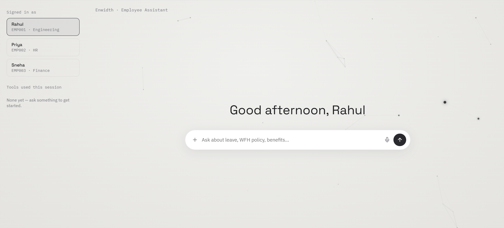
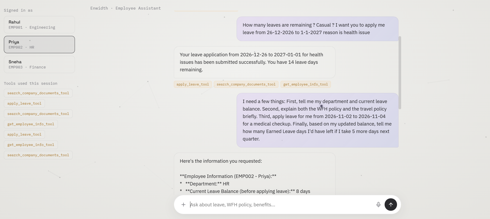
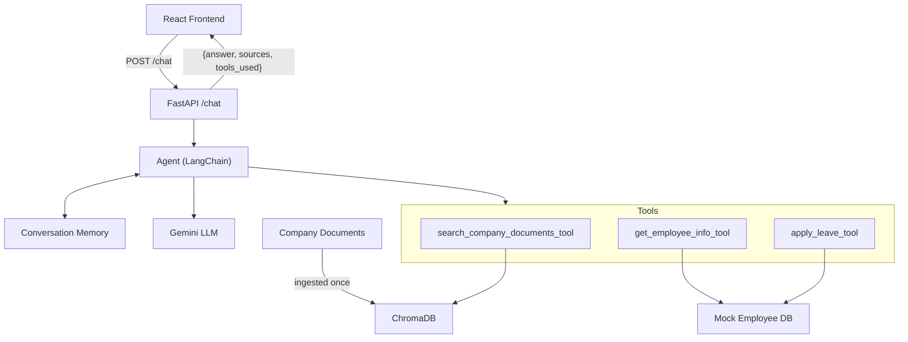

# Enwidth AI Employee Assistant

A RAG + Agentic Employee Assistant built for the Enwidth Technology AI Engineering Assessment. It answers employee questions from company policy documents using Retrieval-Augmented Generation, and performs real employee actions (checking leave balance, applying for leave) through a tool-calling agent.




## Tech Stack

| Layer | Technology |
|---|---|
| Frontend | React (Vite), Framer Motion |
| Backend | Python, FastAPI |
| AI Orchestration | LangChain (`create_agent`), LangGraph (`MemorySaver`) |
| Vector Database | ChromaDB (persisted locally) |
| LLM | Google Gemini (`gemini-3.5-flash`) |
| Embeddings | Google Gemini (`gemini-embedding-001`) |
| Containerization | Docker, Docker Compose |

## Architecture



A more detailed architecture breakdown (ingestion pipeline, query sequence diagram) is in [`docs/architecture-design.md`](docs/architecture-design.md).

## Setup

Both options need a `.env` file first:
```bash
cd backend
cp .env.example .env
```
Open `backend/.env` and add your own [free Gemini API key](https://aistudio.google.com/apikey) as `GEMINI_API_KEY_1`. (`GEMINI_API_KEY_2`/`_3` are optional extra keys for automatic fallback — see [Limitations](#limitations).)

### Option A — Docker (recommended)
```bash
docker compose up --build
```
| Service | URL |
|---|---|
| Frontend | http://localhost:3000 |
| Backend | http://localhost:8000 |
| API docs | http://localhost:8000/docs |

### Option B — Manual (if Docker isn't available)
```bash
# Backend
cd backend
python -m venv venv
venv\Scripts\activate        # Windows; use `source venv/bin/activate` on macOS/Linux
pip install -r requirements.txt
python app/vectorstore.py     # builds the vector database (first time only)
uvicorn main:app --reload --app-dir app

# Frontend (separate terminal)
cd frontend
npm install
npm run dev
```

## How It Works

- **Chunking:** Documents are split with LangChain's `RecursiveCharacterTextSplitter` (500 chars, 50 overlap) — small enough for precise retrieval, with overlap so a policy detail is never split and lost.
- **Embeddings:** `gemini-embedding-001` embeds both documents and queries for semantic similarity search.
- **Vector Database:** ChromaDB, persisted to disk at `backend/chroma_data`.
- **Retrieval:** Top-k similarity search, converted to a similarity score. If the best score is below `RETRIEVAL_CONFIDENCE_THRESHOLD` (default `0.4`), the system returns *"I couldn't find this information..."* without calling the LLM — this is the confidence-threshold bonus feature.
- **Agent:** Built with LangChain's `create_agent`, given 3 tools and a system prompt describing when to use each. The agent decides autonomously which tool(s) to call per message.
- **Memory:** LangGraph's `MemorySaver`, keyed by `employee_id`, so each employee's conversation (and follow-up questions) are tracked independently.

## API

`POST /chat`
```json
// Request
{ "employee_id": "EMP001", "message": "How many leaves do I have?" }

// Response
{ "answer": "You have 12 leaves remaining.", "sources": [], "tools_used": ["get_employee_info_tool"] }
```
Full interactive docs at `/docs` once the backend is running.

## Bonus Features Implemented

- Retrieval Confidence Threshold — rejects low-confidence matches before they reach the LLM
- Docker Setup — one-command startup for both services, skips re-embedding if a vector DB already exists
- Conversation Memory — per-employee chat history via LangGraph `MemorySaver`

## Sample Queries

See [`docs/sample-queries.md`](docs/sample-queries.md) for verified example queries and real responses covering RAG, hallucination prevention, tool calling, multi-tool reasoning, agent actions, and conversational context.

## Assumptions

- Employee identity is chosen via a UI dropdown over 3 mock employees (`EMP001`-`EMP003`), matching the assessment's mock-database scope.
- Leave applications are mock operations — they update the in-memory record for the current session only.

## Limitations

- **Conversation history and leave balances reset on backend restart** — no persistent database is used, by design, for this assessment's scope.
- **Gemini's free tier caps requests at 20/day per key.** The included `llm_router.py` rotates across up to 3 keys automatically. A fresh reviewer key should not hit this under normal use.
- **OpenAI is not actively wired in as a live fallback** (it requires paid billing, unlike Gemini's free tier); the abstraction supports adding it back easily.
- **No authentication layer** — acceptable for this assessment's mock-data scope, but would be required for real-world use.
- Runs locally via Docker or manual setup only; not deployed to a public host.
