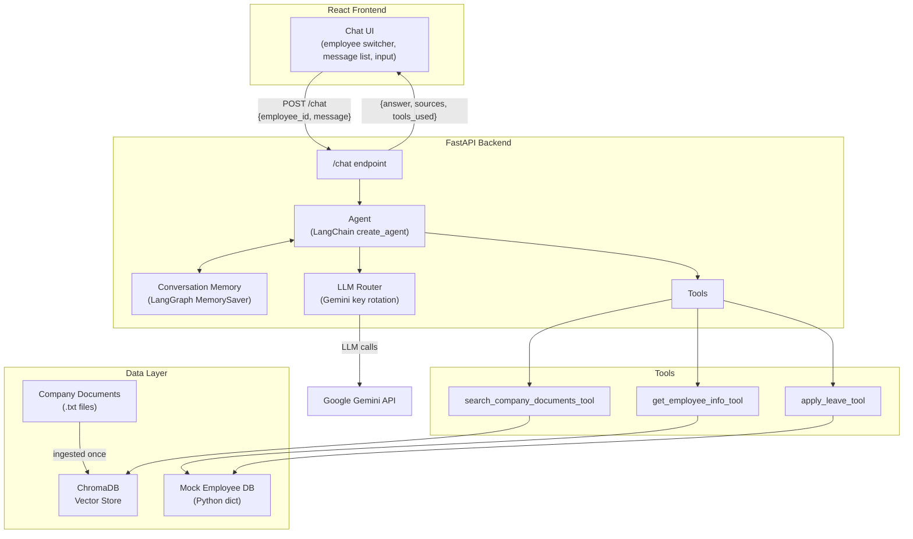
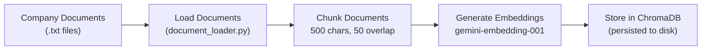
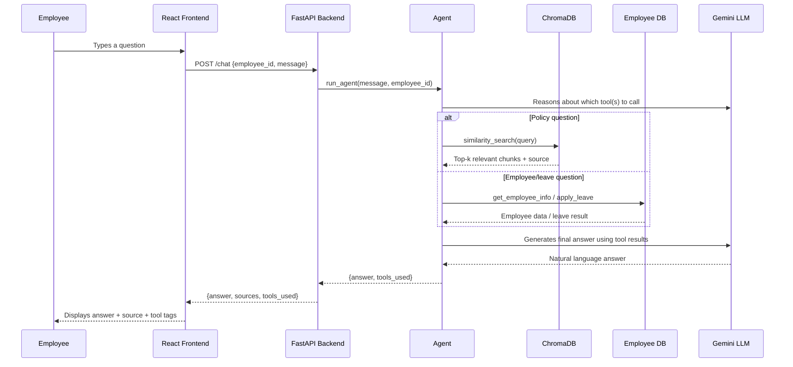

# Enwidth AI Employee Assistant

A RAG + Agentic Employee Assistant built for the Enwidth Technology AI Engineering Assessment. The assistant answers employee questions from company policy documents using Retrieval-Augmented Generation, and performs real employee actions (checking leave balance, applying for leave) through an autonomous tool-calling agent.


---

## Table of Contents

- [Features](#features)
- [Tech Stack](#tech-stack)
- [Architecture](#architecture)
- [Setup Instructions](#setup-instructions)
  - [Option A — Docker (Recommended)](#option-a--docker-recommended)
  - [Option B — Manual Setup](#option-b--manual-setup)
- [Project Structure](#project-structure)
- [Chunking Strategy](#chunking-strategy)
- [Embedding Model](#embedding-model)
- [Vector Database](#vector-database)
- [Retrieval Approach](#retrieval-approach)
- [Agent & Tool Implementation](#agent--tool-implementation)
- [Conversational Memory](#conversational-memory)
- [API Reference](#api-reference)
- [Bonus Features Implemented](#bonus-features-implemented)
- [Sample Queries](#sample-queries)
- [Assumptions](#assumptions)
- [Limitations](#limitations)

---

## Features

- Answers employee questions using company policy documents (RAG)
- Cites the exact source document(s) used for every answer
- Refuses to answer when no relevant document is found (hallucination prevention)
- Autonomously decides which tool(s) to use based on user intent (agentic workflow)
- Looks up mock employee records and applies mock leave requests
- Remembers conversation context per employee (follow-up questions work correctly)
- Full working frontend (React) and backend (FastAPI) with a documented `/chat` API
- Dockerized — runs with a single command

---

## Tech Stack

| Layer | Technology |
|---|---|
| Frontend | React (Vite), Framer Motion, Lucide Icons |
| Backend | Python, FastAPI, Uvicorn |
| AI Orchestration | LangChain (`create_agent`), LangGraph (`MemorySaver`) |
| Vector Database | ChromaDB (persisted locally) |
| LLM | Google Gemini (`gemini-2.5-flash`) |
| Embeddings | Google Gemini (`gemini-embedding-001`) |
| Containerization | Docker, Docker Compose |

---

## Architecture

### System Overview



### Document Ingestion Pipeline



### Query-Time Flow



---

## Setup Instructions

### Prerequisites

- A Google Gemini API key ([get one free here](https://aistudio.google.com/apikey))
- **Docker Desktop** (for Option A) **or** Python 3.12+ and Node.js 20+ (for Option B)

Both options require the same `.env` file. Create it once:

```bash
cd backend
cp .env.example .env
```

Then open `backend/.env` and fill in your own Gemini API key(s):

```
GEMINI_API_KEY_1=your_gemini_api_key_here
GEMINI_API_KEY_2=optional_second_key_for_fallback
GEMINI_API_KEY_3=optional_third_key_for_fallback
OPENAI_API_KEY=optional_openai_key
CHROMA_DB_PATH=./chroma_data
RETRIEVAL_CONFIDENCE_THRESHOLD=0.4
```

> Only `GEMINI_API_KEY_1` is required. Keys 2 and 3 are optional — see [LLM Router](#agent--tool-implementation) below for why multiple keys are supported.

---

### Option A — Docker (Recommended)

This is the primary, tested way to run the full application with one command.

```bash
docker compose up --build
```

This builds and starts both containers:

| Service | URL |
|---|---|
| Frontend | http://localhost:3000 |
| Backend API | http://localhost:8000 |
| Interactive API docs | http://localhost:8000/docs |

On first run, the backend automatically builds the vector database from the documents in `backend/documents`. On subsequent runs, it detects the existing database and skips rebuilding (to avoid unnecessary embedding API calls).

To stop:
```bash
docker compose down
```

---

### Option B — Manual Setup (if Docker is not available)

**Backend:**

```bash
cd backend
python -m venv venv
venv\Scripts\activate        # Windows
# source venv/bin/activate   # macOS/Linux

pip install -r requirements.txt

# Build the vector database (only needed once, or when documents change)
python app/vectorstore.py

# Start the API server
uvicorn main:app --reload --app-dir app
```

Backend will be available at `http://127.0.0.1:8000`.

**Frontend** (in a separate terminal):

```bash
cd frontend
npm install
npm run dev
```

Frontend will be available at `http://localhost:5173`.

---

## Project Structure

```
Enwidth-ai-employee-assistant/
├── backend/
│   ├── app/
│   │   ├── document_loader.py    # Loads + chunks company documents
│   │   ├── vectorstore.py        # Embeddings + ChromaDB storage/retrieval
│   │   ├── rag.py                # Core RAG: retrieve, threshold check, generate answer
│   │   ├── employee_db.py        # Mock employee database + leave logic
│   │   ├── tools.py               # LangChain tool wrappers (RAG + employee functions)
│   │   ├── llm_router.py         # Automatic Gemini API key rotation/fallback
│   │   ├── agent.py               # Agent construction + conversational memory
│   │   └── main.py                # FastAPI app + /chat endpoint
│   ├── documents/                 # Company policy documents (.txt)
│   ├── Dockerfile
│   ├── start.sh
│   ├── requirements.txt
│   └── .env.example
├── frontend/
│   ├── src/
│   │   ├── components/
│   │   │   ├── ParticleBackground.jsx
│   │   │   ├── Sidebar.jsx
│   │   │   ├── ChatWindow.jsx
│   │   │   └── MessageBubble.jsx
│   │   ├── api.js
│   │   ├── constants.js
│   │   └── App.jsx
│   └── Dockerfile
├── docs/
│   ├── screenshots/
│   └── architecture-design.md
├── docker-compose.yml
└── README.md
```

---

## Chunking Strategy

Documents are split using LangChain's `RecursiveCharacterTextSplitter` with:

- **Chunk size:** 500 characters
- **Chunk overlap:** 50 characters

Company policy documents are short and paragraph-structured, so a moderate chunk size with overlap keeps each individual rule intact within a chunk while avoiding retrieval of overly broad or irrelevant context. The overlap prevents a policy detail from being awkwardly split across two chunks and lost during retrieval.

---

## Embedding Model

**`gemini-embedding-001`** (Google Generative AI) is used to convert both document chunks and user queries into vector embeddings, so semantic similarity — not just keyword matching — drives retrieval.

---

## Vector Database

**ChromaDB**, persisted to disk (`backend/chroma_data`). Chosen for its simplicity, zero external infrastructure requirement, and native LangChain integration (`langchain-chroma`), making it well suited for a self-contained, easily reviewable assessment project.

---

## Retrieval Approach

1. The user's query is embedded using the same model as the documents.
2. `similarity_search_with_score` retrieves the top-k most similar chunks from ChromaDB.
3. Chroma's raw distance score is converted to a similarity score (`1 - distance`).
4. **Confidence threshold check** *(bonus feature)*: if the best match's similarity score falls below `RETRIEVAL_CONFIDENCE_THRESHOLD` (default `0.4`), the system immediately returns *"I couldn't find this information in the provided documents."* without calling the LLM at all — preventing hallucination and saving an unnecessary API call.
5. If confident enough, the retrieved chunks are passed to Gemini along with the question, and the model is instructed to answer **only** using that context.
6. The source filename(s) of the retrieved chunks are returned alongside the answer.

---

## Agent & Tool Implementation

The agent is built using LangChain's `create_agent`, given three tools and a system prompt describing exactly when to use each one:

| Tool | Purpose |
|---|---|
| `search_company_documents_tool` | Wraps the RAG pipeline — used for policy/FAQ questions |
| `get_employee_info_tool` | Looks up name, department, and leave balance from the mock employee database |
| `apply_leave_tool` | Submits a mock leave application and updates the employee's leave balance |

The agent reasons over the user's message and **autonomously decides** which tool(s) to call — a single tool, multiple tools in combination, or none at all (plain conversation) — rather than following hardcoded if/else routing.

**LLM Router (`llm_router.py`):** Since Gemini's free tier enforces a strict daily request quota, the backend supports up to three Gemini API keys and automatically tries each one in sequence, using the first one that responds successfully. This is a practical resilience measure rather than a required feature, and is documented further under [Limitations](#limitations).

---

## Conversational Memory

Implemented using LangGraph's `MemorySaver` as a checkpointer, with each employee's `employee_id` used as the conversation `thread_id`. This keeps every employee's conversation history separate and allows the agent to correctly resolve follow-up questions (e.g. "Can I take 3 days next month?" after previously discussing leave), including understanding state changes from actions already taken (e.g. correctly reporting an updated leave balance after a leave application within the same conversation).

Memory is in-process and resets if the backend restarts — see [Limitations](#limitations).

---

## API Reference

### `POST /chat`

**Request:**
```json
{
  "employee_id": "EMP001",
  "message": "How many leaves do I have?"
}
```

**Response:**
```json
{
  "answer": "You have 12 leaves remaining.",
  "sources": [],
  "tools_used": ["get_employee_info_tool"]
}
```

Full interactive documentation is auto-generated by FastAPI and available at `/docs` once the backend is running.

---

## Bonus Features Implemented

- ✅ **Retrieval Confidence Threshold** — low-confidence retrievals are rejected before reaching the LLM, directly strengthening hallucination prevention.
- ✅ **Docker Setup** — both frontend and backend are containerized and orchestrated with a single `docker-compose.yml`, with the backend intelligently skipping vector database rebuilds when one already exists.
- ✅ **Conversation Memory** — implemented via LangGraph's `MemorySaver`, verified with real follow-up and multi-turn scenarios (see [Sample Queries](#sample-queries)).

---

## Sample Queries

| # | Query | Demonstrates |
|---|---|---|
| 1 | `What is the work from home policy?` | RAG retrieval with correct source citation |
| 2 | `Does the company provide pet insurance?` | Hallucination prevention (confidence threshold) |
| 3 | `How many leaves does EMP001 have?` | Tool calling (`get_employee_info_tool`) |
| 4 | `What is the leave policy and how many leaves do I have remaining?` | Multi-tool reasoning (RAG + employee lookup combined) |
| 5 | `Apply leave for EMP001 from 20 Sept to 22 Sept because I'm travelling.` | Agent action (`apply_leave_tool`), with balance update |
| 6 | `How many leaves will I have after applying?` (asked as a follow-up) | Conversational context — correctly reflects the updated balance |

---

## Assumptions

- Employee identity is selected via a simple dropdown in the UI rather than a real authentication system, since the assessment specifies a mock employee database.
- The three mock employees (`EMP001`, `EMP002`, `EMP003`) are hardcoded for demonstration purposes, matching and extending the example given in the assessment PDF.
- Leave application is a mock operation — it updates the in-memory employee record for the current session but does not persist to any external system.
- A single confidence threshold (`0.4`) is used across all document types; this was tuned empirically against the sample company documents included in this repository.

## Limitations

- **Conversation memory is in-process only** — it resets if the backend server restarts, since no persistent database (e.g. Redis, PostgreSQL) is used for chat history. This was a deliberate scope decision for an assessment-scale project.
- **Employee data is not persisted** — leave balance changes reset when the backend restarts, for the same reason.
- **Gemini's free tier enforces a strict daily request quota** (20 requests/day per key at time of writing). The included LLM Router mitigates this by rotating across up to three keys, but sustained heavy testing can still exhaust all configured keys within a single day. Reviewers running this project with their own fresh API key(s) should not encounter this under normal usage.
- **OpenAI is not actively wired in as a live fallback** in the current configuration, since OpenAI requires paid billing credits even for light testing (no free tier). The `.env.example` still includes a placeholder for it, and the codebase's tool/LLM abstraction would support adding it back as an additional fallback tier with minimal changes.
- **No authentication/authorization layer** — any employee ID can be selected from the UI dropdown without a login step, which is acceptable for this assessment's mock-data scope but would need to be addressed before any real-world use.
- This project is intended to run locally (via Docker or manual setup) and has not been deployed to a public hosting provider; all testing described in this README was performed on localhost.
